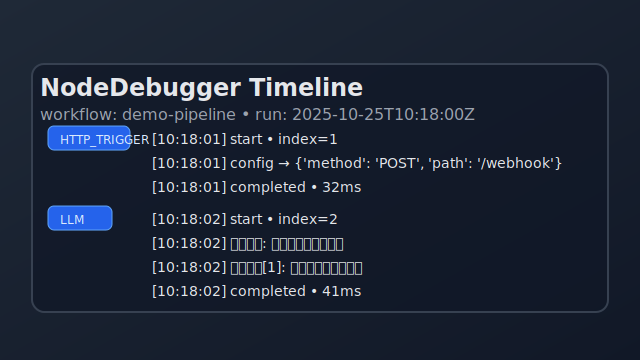

# TriggerFlow Canvas 用户指南

TriggerFlow Canvas 是面向 Agently TriggerFlow 工作流的可视化编排与执行控制台。本文档提供安装部署步骤、运行时配置、常见问题排查方法，以及如何为 Canvas 扩展自定义触发器和节点的开发指南。

## 快速安装

### 环境预检

在首次拉取仓库后执行以下命令，确认本地已安装必须的依赖工具：

```bash
python -m triggerflow_canvas.connector.preflight
```

该命令会检测 Poetry、Node.js、npm 与 Docker 是否可用，并给出版本信息及缺失提示。如遇 `poetry` 与 `poetry.lock` 不匹配，可参考“常见问题”章节中的锁文件修复指南。

### 通过 Docker Compose 启动（推荐）

仓库内置 `docker-compose.yml`，一次性启动前端、后端与 TriggerFlow 核心服务：

```bash
docker compose up --build
```

默认会启动以下组件：

- **backend**：基于 FastAPI 的工作流与运行日志 API，监听 `8000` 端口。
- **frontend**：Vite + React 前端开发服务器，监听 `5173` 端口。
- **triggerflow-core**：触发器执行核心，运行 `triggerflow_canvas.connector.core` 中的占位实现。

启动完成后访问 `http://localhost:5173` 即可进入 Canvas 页面。

> 💡 首次启动会创建前端依赖缓存并编译 TypeScript，时间可能略长。建议在首次成功后使用 `docker compose up` 以复用镜像。

### 本地开发环境

若希望分别运行前端与后端，可按如下步骤手动安装：

1. 安装 Python 3.11+ 与 Node.js 18+。
2. 若 `poetry.lock` 与 `pyproject.toml` 不一致导致安装失败，可执行 `poetry lock --no-update` 重新生成锁文件，再运行 `poetry install`。
3. 安装项目依赖：
   ```bash
   poetry install
   cd triggerflow_canvas/frontend && npm install
   ```
   - 处于受限网络环境时，可先设置 npm 镜像：
     ```bash
     npm config set registry https://registry.npmmirror.com
     npm config set @playwright/test:registry https://registry.npmmirror.com
     ```
4. 启动 TriggerFlow Canvas 后端：
   ```bash
   poetry run uvicorn triggerflow_canvas.backend.main:app --reload --port 8000
   ```
5. 另开终端启动前端：
   ```bash
   cd triggerflow_canvas/frontend
   npm run dev -- --host 0.0.0.0 --port 5173
   ```

## 配置指南

TriggerFlow Canvas 默认配置位于 Python 模块中，可通过修改环境变量或覆盖配置文件自定义行为。

### 数据库

后端使用 SQLite 数据库，连接字符串定义在 `triggerflow_canvas/backend/database.py` 中：

```python
DATABASE_URL = "sqlite+aiosqlite:///./triggerflow_canvas.db"
```

部署到生产环境时，可将该常量替换为 `PostgreSQL` 或其他兼容的 SQLModel 连接串。例如：

```python
DATABASE_URL = os.getenv("TRIGGERFLOW_DATABASE_URL", "sqlite+aiosqlite:///./triggerflow_canvas.db")
```

然后在容器或主机上设置 `TRIGGERFLOW_DATABASE_URL`。

执行 `uvicorn` 时会在应用启动阶段自动调用 `init_db()` 创建表结构；如需关闭自动建表，可在自定义入口文件中移除 `lifespan` 钩子的初始化逻辑。

### 运行参数

- `backend` 通过 `uvicorn triggerflow_canvas.backend.main:app --host 0.0.0.0 --port 8000` 启动。如需修改监听端口，可调整命令参数或在 Docker Compose 中设置 `ports`。
- 前端使用 `npm run dev -- --host 0.0.0.0 --port 5173`。生产部署建议改为 `npm run build` 并使用静态资源服务器或反向代理承载。
- TriggerFlow 核心示例命令为 `python -m triggerflow_canvas.connector.core`，该模块目前输出占位提示，可替换为自定义 TriggerFlow Runtime 入口。

### API & CORS

后端通过 FastAPI 提供 REST API，默认允许所有来源跨域（`allow_origins=['*']`）。若需限制访问域名，请在 `triggerflow_canvas/backend/main.py` 中调整 CORS 中间件配置。

## 常见问题 FAQ

### 前端无法连接后端 API？

确认 `backend` 服务已经运行并监听 `8000` 端口。Docker 模式下需确保端口未被其它进程占用。若部署在远程主机，请在前端 `.env` 中配置 `VITE_API_BASE_URL` 指向后端。

### 执行日志没有输出？

`TriggerFlowConnector.execute` 会逐步模拟节点执行并通过 Server-Sent Events 推送日志。请检查前端监听到的 `runId` 是否有效，或查看后端日志中是否存在异常（`/api/runs/{run_id}/logs`）。

### 如何清空或迁移工作流数据？

停止后端服务后删除默认的 `triggerflow_canvas.db` 文件即可重置所有流程。若使用自定义数据库，请使用相应的 SQL 工具清理数据表 `workflow_records` 与 `run_records`。

### Docker 启动失败显示 `Cannot connect to proxy`？

这是因构建阶段无法连接外部依赖导致，可在受限网络环境中通过设置企业代理或提前下载依赖（例如在内网镜像中缓存 npm/pip 包）。

### `poetry install` 提示锁文件过期？

执行 `poetry lock --no-update` 同步锁文件后重新运行 `poetry install`。如仍失败，可删除 `poetry.lock` 并执行 `poetry lock && poetry install`，然后将新的锁文件提交到仓库。

### 如何在无模型服务的环境下调试流程？

`TriggerFlowConnector` 支持在工作流 JSON 中为节点配置调试覆盖：

```json
{
  "debug": {
    "nodes": {
      "llm-node": {
        "notes": "使用伪响应",
        "input": {"messages": ["hello"]},
        "outputs": ["Hi from debugger"]
      }
    }
  }
}
```

在 Python 侧可通过 `NodeDebugger` 捕获节点执行时间线：

```python
from triggerflow_canvas.connector import NodeDebugger, run_workflow

debugger = NodeDebugger()
workflow = {...}

async for log in run_workflow(workflow, debugger=debugger):
    print(log)

print(debugger.as_dict())
```

下图展示了调试日志的典型输出：



## 触发器与节点开发指南

TriggerFlow Canvas 的后端通过 `TriggerFlowConnector` 将画布节点转换为执行计划。要扩展新触发器或动作节点，可按以下步骤进行：

1. **定义节点模板（前端）**：在 `triggerflow_canvas/frontend/src/App.tsx` 中的 `templates` 数组新增节点类型，设置 `type`、`label`、`description` 与 `defaultConfiguration`，并根据端口方向定义 `ports`。
2. **扩展执行计划编译器**：在 `triggerflow_canvas/connector/engine.py` 中的 `TriggerFlowConnector.compile` 方法里解析新节点的 `type` 和配置，将其转换为 `ExecutionStep`。
3. **实现运行逻辑**：在 `TriggerFlowConnector._simulate_step` 或新的执行函数中，根据节点配置调用对应的 TriggerFlow 处理器。例如对于真正的聊天节点，可使用 `Agently.create_agent()` 并将生成的响应写入日志流。
4. **注册触发器**：如需新增外部触发源，可在前端模板中定义 `trigger.xxx` 类型节点，并在后端 `execute` 方法中处理该节点，或在核心服务中监听外部事件并调用 TriggerFlow runtime。

### 与 TriggerFlow Runtime 集成

- `TriggerFlow` 的 Python API 位于 `agently/core/TriggerFlow` 目录，可使用 `flow.to(handler)` 将节点函数串联成流程。
- 运行期可通过 `flow.create_execution().start(value)` 启动工作流，也可以使用 `flow.get_async_runtime_stream()` 在前端显示流式日志。
- 当需要在 Canvas 中复用已有流程，可将蓝图保存为 JSON 并在 `TriggerFlowConnector.compile` 中读取并映射到 `TriggerFlow` 的 chunk/handler。

## 进一步阅读

- [TriggerFlow Canvas 架构概览](../architecture/triggerflow-canvas.md)
- `triggerflow_canvas/backend` 目录中的模型与仓储实现，了解如何持久化工作流。
- `examples/triggerflow-canvas/` 中的示例流程，展示如何从 Canvas 导出的蓝图映射到 Python TriggerFlow 代码。
